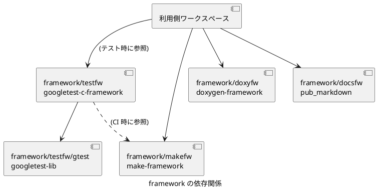

# C モダナイゼーション フレームワーク

既存の C コードを継続的に改善するための統合ワークスペースです。

## 入口

- [作業規則](AGENTS.md)
- [文書一覧](docs/README.md)
- [全 app 共通の規範](app/general/docs/README.md)
- [ワークスペース固有の運用](app/c-modernization-kit/docs/README.md)

## 概要

C および C++ の開発、ビルド、自動テスト、ドキュメント生成を Linux と Windows で共通化します。  
各機能は `framework/` 配下のフレームワークとして分離し、利用する app はワークスペースごとに選択できます。

## 特徴

- Linux では GCC、Windows では MSVC を使用し、共通の Make インターフェースからビルドします。
- Google Test を利用し、プロダクション コードから分離したテストとエビデンスを生成します。
- Doxygen と Doxybook2 を利用して、C および C++ の API 資料を生成します。
- Pandoc を利用して、Markdown から HTML と DOCX を静的発行します。
- MkDocs を利用して、Markdown を動的発行します。図はブラウザー上でレンダリングし、保存に追従して再生成します。
- C ライブラリと連携する .NET プロジェクトを、C および C++ と同じワークスペースで管理できます。

## Windows 環境における注意事項

Windows では、`Start-VSCode-With-Env.cmd` を使用して VS Code を起動してください。  
このスクリプトは MinGW の PATH と Visual Studio Build Tools の環境変数を設定します。

```powershell
.\Start-VSCode-With-Env.cmd
```

## サブモジュール

このフレームワークは、ビルド、テスト、API ドキュメント生成、Markdown 発行を独立したサブモジュールとして管理します。  
Clone 後にサブモジュールを初期化してください。

```bash
git submodule update --init --recursive
```

- `framework/docsfw` - Markdown 発行フレームワーク。静的発行 (Pandoc) と動的発行 (MkDocs) ([https://github.com/Hondarer/pub_markdown](https://github.com/Hondarer/pub_markdown))
- `framework/doxyfw` - Doxygen ドキュメント生成フレームワーク ([https://github.com/Hondarer/doxygen-framework](https://github.com/Hondarer/doxygen-framework))
- `framework/makefw` - Make ビルド フレームワーク ([https://github.com/Hondarer/make-framework](https://github.com/Hondarer/make-framework))
- `framework/testfw` - Google Test ベースのテスト フレームワーク ([https://github.com/Hondarer/googletest-c-framework](https://github.com/Hondarer/googletest-c-framework))

サブモジュールの実配置は `.gitmodules` に定義しています。

## app の構成

`app/general` には、本フレームワークを利用するワークスペースに共通する規範、設計、運用手順を配置しています。  
フレームワークを別のワークスペースへ展開するときも、`app/general` は標準配布に含めます。

それ以外の各 app は、必要な機能とサンプルに応じて選択できます。  
各 app の依存関係は `appdeps.mk`、ビルド対象と成果物は `makepart.mk` を正本とします。

### framework の依存関係



## ライセンス

[LICENSE](./LICENSE) を参照してください。
