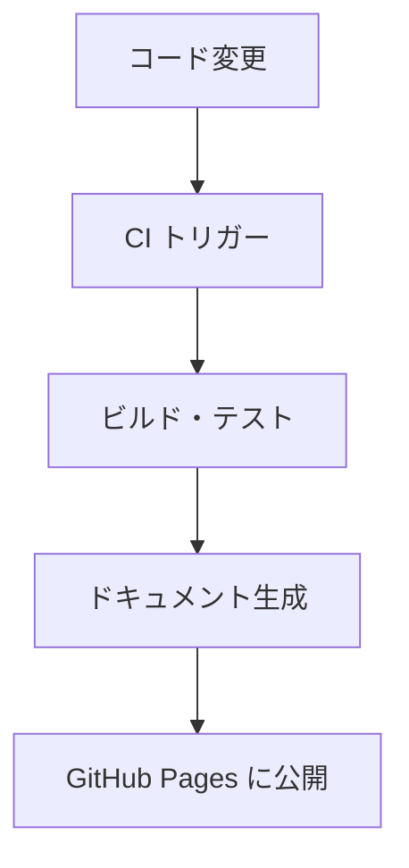

# Mermaid

## 概要

Mermaid はテキスト形式でフローチャート・シーケンス図・ガント チャートなどを記述し、画像として出力するツールです。GitHub や GitLab がネイティブで Mermaid 記法をレンダリングするため、`README.md` などのリポジトリ ドキュメントに図を直接埋め込んで確認できます。

対象ワークスペースでは図の作成に PlantUML・Mermaid・draw.io の 3 種類のツールを使用できます。意味論を明確に表現しやすいことから PlantUML を第 1 選択としていますが、GitHub 上でのプレビューを重視する場合や、フローチャートなど記法の簡潔さを優先する場合に Mermaid が有効です。`docsfw` サブモジュールは `framework/docsfw/` に配置され、Mermaid コード ブロックを Pandoc で変換する機能を提供しています。

## 習得目標

- [ ] Mermaid のフローチャート (`flowchart`) 記法を書ける
- [ ] Mermaid のシーケンス図 (`sequenceDiagram`) を書ける
- [ ] GitHub 上で Mermaid 図がレンダリングされることを確認できます。
- [ ] Markdown ファイルに Mermaid コード ブロックを埋め込める
- [ ] PlantUML と Mermaid の使い分け基準を説明できます。

## 学習マテリアル

### 公式ドキュメント

- [Mermaid 公式サイト](https://mermaid.js.org/) - Mermaid のドキュメント (英語)
    - [フローチャート](https://mermaid.js.org/syntax/flowchart.html) - 基本的なフロー図の記法
    - [シーケンス図](https://mermaid.js.org/syntax/sequenceDiagram.html) - シーケンス図の記法
    - [Mermaid Live Editor](https://mermaid.live/) - ブラウザーで即試せるエディター
- [GitHub - 図の作成](https://docs.github.com/ja/get-started/writing-on-github/working-with-advanced-formatting/creating-diagrams) - GitHub での Mermaid 利用方法 (日本語)

## 対象ワークスペースとの関連

### 図ツールの選択基準

| ツール       | 特徴                                | 推奨ケース                                                     |
|--------------|-------------------------------------|----------------------------------------------------------------|
| PlantUML     | UML の意味論を厳密に表現できます。      | シーケンス図・クラス図・コンポーネント図など (第 1 選択)        |
| Mermaid      | GitHub でネイティブ表示・記法が簡潔 | フロー図など、GitHub 上でのプレビューを重視する場合 (第 2 選択) |
| draw.io      | GUI で自由に作図できます。              | UML の意味論で表現しにくい任意のレイアウトの図 (第 3 選択)      |
| PNG/SVG など | 既存の画像をそのまま利用できます。      | 外部ツールで作成済みの図・スクリーンショットなど (第 4 選択)    |

Table: 図ツールの選択基準

### 使用箇所 (具体的なファイル・コマンド)

Markdown への埋め込み方法:

````markdown

````

GitHub 上では上記のコード ブロックがそのまま図としてレンダリングされます。Pandoc での変換時は `framework/docsfw/lib/` の Lua フィルターが Mermaid コード ブロックを検出して画像に変換します。

### 関連ドキュメント

- [PlantUML (スキル ガイド)](plantuml.md) - UML 図の第 1 選択ツール
- [draw.io (スキル ガイド)](drawio.md) - GUI 作図ツール (第 3 選択)
- [Pandoc (スキル ガイド)](pandoc.md) - Mermaid 図を含む Markdown の変換
- [Markdown (スキル ガイド)](markdown.md) - 図を埋め込む Markdown の基礎
