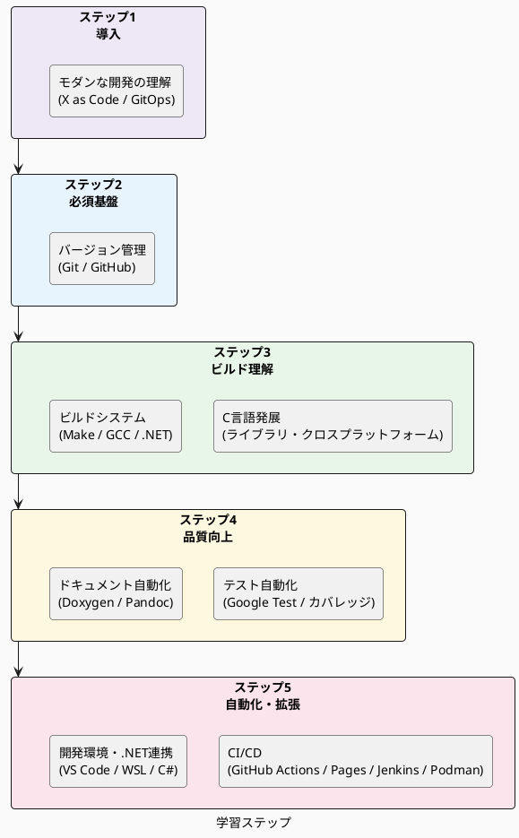

# スキル ガイド - 学習ロードマップ

このスキル ガイドは、本フレームワークを活用するために必要な技術スキルを整理した学習ガイドです。  
レガシ C 言語開発チームが段階的にモダンな開発プラクティスを習得できるよう、5 つのステップに分けて学習マテリアルをまとめています。

各スキル ガイドは「学習の入り口」として機能します。  
技術の詳細な解説は外部の公式ドキュメントやチュートリアルへのリンクで提供し、フレームワーク内の構成要素との関係を示します。

## 対象読者

- C 言語の基本的な知識を持つ開発者
- Git・自動ビルド・自動テスト・ドキュメント自動化の経験が少ない開発者
- 本フレームワークを利用するコードを読み、ビルドし、拡張したい開発者

> C 言語の基礎 (変数・関数・ポインタなど) は習得済みを前提とします。

## 学習ステップ

| ステップ                 | 目標                                     | 技術カテゴリ                 |
|--------------------------|------------------------------------------|------------------------------|
| ステップ 1: 導入         | モダン開発の全体像と背景を理解できる     | X as Code・GitOps・生成 AI   |
| ステップ 2: 必須基盤     | チームでコードを共有・管理できる         | バージョン管理               |
| ステップ 3: ビルド理解   | ライブラリのビルドと依存関係を理解できる | C ライブラリ・ビルド システム |
| ステップ 4: 品質向上     | テストとドキュメントを自動化できる       | テスト・ドキュメント         |
| ステップ 5: 自動化・拡張 | CI/CD とクロス言語連携を実現できる       | CI/CD・開発環境・.NET        |

Table: 学習ステップ一覧

## [ステップ 1 - 導入 (モダンな開発の理解)](01-modern-development/README.md)

技術スキルを習得する前に、モダン開発の全体像・背景・思想を把握します。

| ドキュメント | 内容 |
|------------|------|
| [レガシ C コードにモダン手法を適用する全体像](01-modern-development/about-modern-development.md) | Docs as Code・自動テスト・CI/CD を組み合わせた全体ワークフロー |
| [生成 AI 時代のソース コード管理 (X as Code)](01-modern-development/x_as_code.md) | X as Code・GitOps・生成 AI 活用の DevOps 進化論 |
| [ADR (Architecture Decision Record)](01-modern-development/adr.md) | 設計判断の背景・根拠・影響を短い文書で残す方法 |

Table: ステップ 1 ドキュメント一覧

## [ステップ 2 - 必須基盤 (バージョン管理)](02-version-control/README.md)

Git を使ったバージョン管理はすべての現代的な開発の基盤です。まずここから始めてください。

| スキル ガイド          | 内容                           |
|-----------------------|--------------------------------|
| [Git 基礎](02-version-control/git-basics.md)                 | init/clone/commit/branch/merge |
| [Git サブモジュール](02-version-control/git-submodules.md)   | サブモジュールの操作           |
| [GitHub ワークフロー](02-version-control/github-workflow.md) | PR・Issues・コード レビュー     |

Table: バージョン管理スキル ガイド一覧

## ステップ 3 - ビルド理解

C ライブラリの種類とビルド システムを理解することで、対象ワークスペースのコード構造を把握できます。

### [C 言語発展トピック](03-c-language/README.md)

| スキル ガイド                 | 内容                                             |
|------------------------------|--------------------------------------------------|
| [C ライブラリの種類](03-c-language/c-library-types.md)           | 静的ライブラリ・動的ライブラリの違いとリンク方法 |
| [クロスプラットフォーム対応](03-c-language/c-cross-platform.md) | Linux / Windows 対応マクロとビルド条件分岐       |

Table: C 言語発展トピック スキル ガイド一覧

### [ビルド システム](04-build-system/README.md)

| スキル ガイド                | 内容                                    |
|-----------------------------|-----------------------------------------|
| [GNU Make](04-build-system/gnu-make.md)                       | makefile の基礎と階層ビルド構造         |
| [GCC / MSVC ツールチェーン](04-build-system/gcc-toolchain.md) | コンパイラとリンカーのオプション          |
| [.NET SDK](04-build-system/dotnet-sdk.md)                     | dotnet コマンドと .NET プロジェクト構造 |

Table: ビルド システム スキル ガイド一覧

## ステップ 4 - 品質向上

テストの自動化とドキュメントの自動生成により、品質と保守性を高めます。

### [テスト自動化](05-testing/README.md)

| スキル ガイド       | 内容                           |
|--------------------|--------------------------------|
| [Google Test](05-testing/google-test.md)        | C/C++ 単体テスト フレームワーク |
| [コード カバレッジ](05-testing/code-coverage.md) | gcov / lcov / OpenCppCoverage  |
| [.NET テスト](05-testing/dotnet-testing.md)     | xUnit による .NET 単体テスト   |

Table: テスト自動化スキル ガイド一覧

### [ドキュメント自動化](06-documentation/README.md)

| スキル ガイド | 内容                                     |
|--------------|------------------------------------------|
| [Markdown](06-documentation/markdown.md) | ドキュメント記法の基礎                    |
| [Doxygen](06-documentation/doxygen.md)   | C/C++ ソース コードからのドキュメント生成  |
| [Pandoc](06-documentation/pandoc.md)     | Markdown から HTML/docx への変換          |
| [PlantUML](06-documentation/plantuml.md) | テキストベースの UML 図表作成 (第 1 選択) |
| [Mermaid](06-documentation/mermaid.md)   | テキストベースの図表作成 (第 2 選択)      |
| [draw.io](06-documentation/drawio.md)    | GUI による任意の図作成 (第 3 選択)        |

Table: ドキュメント自動化スキル ガイド一覧

## ステップ 5 - 自動化・拡張

CI/CD によるビルド・テストの自動化と、.NET 連携および開発環境の整備を行います。

### [CI/CD](07-ci-cd/README.md)

| スキル ガイド      | 内容                         |
|-------------------|------------------------------|
| [GitHub Actions](07-ci-cd/github-actions.md) | 自動ビルド・テスト・デプロイ |
| [GitHub Pages](07-ci-cd/github-pages.md)     | 生成ドキュメントの公開       |
| [Jenkins](07-ci-cd/jenkins.md)               | Oracle Linux 8 への Jenkins 導入、ビルド ジョブ構成、ドキュメント公開 |
| [Podman](07-ci-cd/podman.md)                 | rootless Podman と Oracle Linux 開発コンテナーの利用 |

Table: CI/CD スキル ガイド一覧

### [開発環境・.NET 連携](08-dev-environment/README.md)

| スキル ガイド       | 内容                              |
|--------------------|-----------------------------------|
| [VS Code](08-dev-environment/vscode.md)              | エディターの設定と拡張機能          |
| [WSL / MinGW 環境](08-dev-environment/wsl-mingw.md)  | Windows での Linux 互換ビルド環境 |
| [C# / P/Invoke](08-dev-environment/dotnet-csharp.md) | .NET から C ライブラリを呼び出す  |

Table: 開発環境・.NET 連携スキル ガイド一覧

## 関連ドキュメント

対象ワークスペースの実装・設計の詳細については、以下のドキュメントを参照してください。

- [ビルド設計](../build-design.md) - 対象ワークスペースのビルド構成の詳細
- [テスト チュートリアル](../testing-tutorial.md) - テスト フレームワークの実践的な使い方
- [GitHub Actions](07-ci-cd/github-actions.md) - CI/CD ワークフローの構成方法
