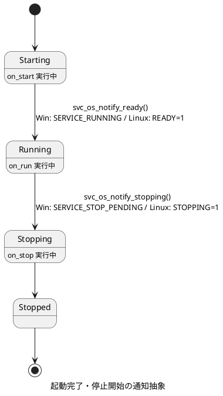
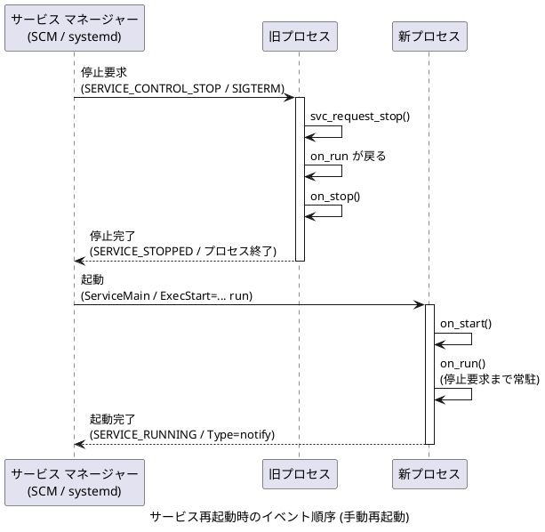

# サービス イベントのタイミング

この文書では、Windows サービスと systemd サービスで扱えるイベントのタイミングを整理します。

最初に両 OS の一般的なイベントを説明し、続けて `service-sample` の現行実装で抽象化している範囲と、実際に扱っているイベントを説明します。

## Windows サービスの一般的なイベント

Windows サービスは Service Control Manager (SCM) から起動され、サービス コントロール ハンドラーで制御要求を受け取ります。

| タイミング | SCM の制御または状態 | 説明 |
|---|---|---|
| 起動開始 | `ServiceMain` | SCM からサービス プロセスが起動され、`StartServiceCtrlDispatcher` 経由で呼ばれる。 |
| 起動中 | `SERVICE_START_PENDING` | 初期化中であることを SCM に通知します。 |
| 起動完了 | `SERVICE_RUNNING` | サービスが要求を受け付けられる状態になったことを SCM に通知します。 |
| 停止要求 | `SERVICE_CONTROL_STOP` | `sc stop`、サービス管理画面、削除前の停止などで送られる。 |
| 停止中 | `SERVICE_STOP_PENDING` | 停止処理中であることを SCM に通知します。 |
| 停止完了 | `SERVICE_STOPPED` | サービスが終了したことを SCM に通知します。 |
| OS シャットダウン | `SERVICE_CONTROL_SHUTDOWN` | OS のシャットダウン時に、受け付けを宣言したサービスへ送られる。 |
| OS シャットダウン前 | `SERVICE_CONTROL_PRESHUTDOWN` | 通常のシャットダウン通知より前に送られる。受け付けの宣言が必要。 |
| 状態照会 | `SERVICE_CONTROL_INTERROGATE` | SCM が現在状態の再通知を求める。 |
| 一時停止 | `SERVICE_CONTROL_PAUSE` | 一時停止をサポートするサービスへ送られる。 |
| 再開 | `SERVICE_CONTROL_CONTINUE` | 一時停止中のサービスへ送られる。 |
| 電源状態変更 | `SERVICE_CONTROL_POWEREVENT` | サスペンド、レジュームなどの電源イベントで送られる。 |
| セッション変更 | `SERVICE_CONTROL_SESSIONCHANGE` | ログオン、ログオフ、リモート接続などで送られる。 |
| デバイス変更 | `SERVICE_CONTROL_DEVICEEVENT` | デバイス到着、削除などで送られる。別途通知登録が必要。 |
| ハードウェア プロファイル変更 | `SERVICE_CONTROL_HARDWAREPROFILECHANGE` | ハードウェア プロファイル変更時に送られる。 |
| 時刻変更 | `SERVICE_CONTROL_TIMECHANGE` | システム時刻の変更時に送られる。 |
| サービス トリガー | `SERVICE_CONTROL_TRIGGEREVENT` | サービス トリガー条件が発火したときに送られる。 |
| 独自制御 | `128` から `255` | アプリケーション定義の制御コード。 |

Table: Windows サービスの一般的なイベント

## systemd サービスの一般的なイベント

systemd では、Windows SCM のような制御コード列挙ではなく、unit ファイル、プロセス終了、シグナル、必要に応じた `sd_notify()` でライフサイクルを表現します。

| タイミング | unit 設定または通知 | 説明 |
|---|---|---|
| 起動条件 | `ExecCondition=` | 起動可否を判定します。失敗時は `ExecStart=` を実行しません。 |
| 起動前処理 | `ExecStartPre=` | 本体起動前に実行します。 |
| 起動処理 | `ExecStart=` | サービス本体を起動します。 |
| 起動完了判定 | `Type=` | `simple`、`exec`、`forking`、`notify` などで完了判定が変わる。 |
| 起動後処理 | `ExecStartPost=` | 起動完了後に実行します。 |
| リロード | `ExecReload=` | `systemctl reload` で実行します。 |
| 停止処理 | `ExecStop=` | `systemctl stop` で実行します。未指定の場合は通常 `SIGTERM` が送られる。 |
| 停止後処理 | `ExecStopPost=` | 正常停止、失敗停止の後に実行します。 |
| 自動再起動 | `Restart=` | 失敗時などの再起動条件を指定します。 |
| watchdog | `WatchdogSec=` | `sd_notify("WATCHDOG=1")` と組み合わせて死活監視します。 |

Table: systemd サービスの一般的なイベント

`Type=` により、systemd が起動完了とみなすタイミングは変わります。

| `Type=` | 起動完了タイミング |
|---|---|
| `simple` | `ExecStart=` のプロセスを fork した直後。 |
| `exec` | `execve()` 成功後。 |
| `forking` | 親プロセス終了後。 |
| `oneshot` | `ExecStart=` のプロセス終了後。 |
| `dbus` | 指定した D-Bus 名の取得後。 |
| `notify` | サービスが `READY=1` を通知した後。 |
| `notify-reload` | 起動は `notify` と同様。reload は `RELOADING=1` から `READY=1` まで。 |
| `idle` | 他の起動ジョブの処理後、または短いタイムアウト後。 |

Table: systemd の `Type=` による起動完了タイミング

## systemd-devel を使わない場合に扱えるイベント

`systemd-devel` を使わない場合でも、サービス プロセスは通常の Linux プロセスとして systemd から管理されます。  
そのため、次の範囲は C 標準ライブラリ、POSIX シグナル、unit ファイルだけで扱えます。

| 種別 | 扱える内容 |
|---|---|
| 起動 | `ExecStart=` でプロセスを起動します。 |
| 起動完了通知 | `NOTIFY_SOCKET` へ `AF_UNIX/SOCK_DGRAM` で直接送信し、`READY=1` を通知します。 |
| 停止 | `SIGTERM`、`SIGINT` など補足可能なシグナルを処理します。 |
| 停止開始通知 | `NOTIFY_SOCKET` へ直接送信し、`STOPPING=1` を通知します。 |
| 終了結果 | プロセスの終了コードで成功または失敗を systemd に伝える。 |
| 再起動 | `Restart=`、`RestartSec=` で systemd 側に再起動を任せる。 |
| 起動前後の処理 | `ExecStartPre=`、`ExecStartPost=` を unit ファイルに定義します。 |
| 停止前後の処理 | `ExecStop=`、`ExecStopPost=` を unit ファイルに定義します。 |
| リロード | `ExecReload=` と任意のシグナル処理を組み合わせる。 |

Table: `systemd-devel` なしで扱える systemd イベント

一方で、`sd_notify()` が必要な次の通知は `libsystemd` なしでは扱えません。

| 通知 | `systemd-devel` なしの扱い |
|---|---|
| `RELOADING=1` | reload 開始を systemd に明示通知できません。 |
| `WATCHDOG=1` | systemd watchdog へ定期応答できません。 |
| `STATUS=` | `systemctl status` に任意の進行状況メッセージを通知できません。 |
| `EXTEND_TIMEOUT_USEC=` | 起動、停止、reload のタイムアウト延長を要求できません。 |
| `MAINPID=` | サービス側から main PID を明示通知できません。 |

Table: `systemd-devel` なしでは扱えない `sd_notify()` 通知

`READY=1` と `STOPPING=1` は `NOTIFY_SOCKET` へ直接書き込むことで `libsystemd` なしに送信できます。  
かつての `service-sample` はこの方式 (libsystemd 非依存の自前実装) を採用していましたが、現在は電源・セッション イベントの D-Bus 連携 (sd_bus) のために `libsystemd` へ直接リンクしており、通知も `sd_notify(3)` で送信します。  
`Type=notify` と組み合わせることで `on_start` の初期化完了を systemd の起動完了と一致させる点は変わりません。

## service-sample における抽象化範囲

`service-sample` のフレームワークは、ライフサイクルの遷移点と再読込の前後で OS へ自動通知します。  
この通知は OS フック (`svc_os_notify_ready` / `svc_os_notify_stopping` / `svc_os_notify_reloading` / `svc_os_notify_status`) として抽象化されており、コールバック (on_start / on_run / on_stop) の契約は変わりません。

| 概念 | タイミング | Windows (SCM) | Linux (systemd) |
|---|---|---|---|
| 起動完了 | `on_start` 成功直後 | `SERVICE_RUNNING` を SCM に通知します。 | `READY=1` を送信します。 |
| 停止開始 | `on_run` 復帰直後 | `SERVICE_STOP_PENDING` を SCM に通知します。 | `STOPPING=1` を送信します。 |
| 再読込開始 | `on_reload` 呼び出し直前 | 何もしない (SCM に等価通知なし) | `RELOADING=1` を送信します。 |
| 再読込完了 | `on_reload` 復帰直後 | 何もしない (SCM に等価通知なし) | `READY=1` を再送信します。 |
| 状態テキスト | `svc_set_status_text()` 呼び出し時 | トレース出力のみ (SCM に等価機能なし) | `STATUS=` を送信します。 |

Table: `service-sample` の通知抽象

ライフサイクル コールバック (on_start / on_run / on_stop) は、戻り値で成功 (0) と失敗 (0 以外) を返します。  
最初に失敗したコールバックの戻り値は、Windows では `SERVICE_STOPPED` 報告時の `ERROR_SERVICE_SPECIFIC_ERROR` + `dwServiceSpecificExitCode`、Linux ではプロセス終了コードとして OS に伝わり、[自動再起動](#自動再起動の対応状況) の発動条件になります。  
on_run が失敗を返しても、後始末のため on_stop は実行されます。  
Linux ではプロセス終了コードになるため、失敗の値は 1 から 255 の範囲を推奨します。

さらに、OS イベントを共通のイベント種別 (`svc_event_type`) に対応付け、任意のコールバック `on_event` へ配送します。

| 共通イベント | Windows (SCM) | Linux (systemd-logind) |
|---|---|---|
| `SVC_EVENT_POWER_SUSPEND` | `SERVICE_CONTROL_POWEREVENT` + `PBT_APMSUSPEND` | `PrepareForSleep(true)` |
| `SVC_EVENT_POWER_RESUME` | `SERVICE_CONTROL_POWEREVENT` + `PBT_APMRESUMEAUTOMATIC` / `PBT_APMRESUMESUSPEND` | `PrepareForSleep(false)` |
| `SVC_EVENT_SESSION_LOGON` | `SERVICE_CONTROL_SESSIONCHANGE` + `WTS_SESSION_LOGON` | `SessionNew` |
| `SVC_EVENT_SESSION_LOGOFF` | `SERVICE_CONTROL_SESSIONCHANGE` + `WTS_SESSION_LOGOFF` | `SessionRemoved` |
| `SVC_EVENT_PRESHUTDOWN` | `SERVICE_CONTROL_PRESHUTDOWN` | `PrepareForShutdown(true)` |

Table: `service-sample` の OS イベント抽象

設定再読込は `on_reload` コールバックとして抽象化されており、Windows は `SERVICE_CONTROL_PARAMCHANGE`、Linux は `SIGHUP` (`systemctl reload`) が同じコールバックに対応付けられます。

`on_event` と `on_reload` には次の契約があります。

- 両 OS とも `on_run` とは別のスレッド (Windows: SCM ハンドラー スレッド、Linux: イベント監視スレッド) から呼ばれるため、共有データへのアクセスには同期が必要です。
- OS 側の応答期限があるため、短時間で戻る必要があります。Linux のサスペンド・シャットダウン前の猶予は logind の delay inhibitor lock によるもので、上限は `InhibitDelayMaxSec` (既定 5 秒) です。Windows の pre-shutdown 猶予は install 時に 30 秒で登録します。
- `svc_definition` の `on_event` / `on_reload` を NULL にした場合、該当イベントの受け付け自体を行いません (Windows は `SERVICE_ACCEPT_*` を宣言せず、Linux は監視を構築しません)。



コンソール モード (`console` コマンド) や `NOTIFY_SOCKET` が未設定の環境では、各フックが no-op になります。

## service-sample の Windows 対応範囲

`service-sample_windows.c` は `RegisterServiceCtrlHandlerExW` でコントロール ハンドラーを登録し、次の制御を扱います。

| タイミング | 対応状況 | 実装上の動作 |
|---|---|---|
| 起動開始 | 対応 | `ServiceMain` で `SERVICE_START_PENDING` を通知し、`on_start` を呼ぶ。 |
| 起動完了 | 対応 | `on_start` 成功後に `SERVICE_RUNNING` を通知し、`on_run` を呼ぶ。 |
| 停止要求 | 対応 | `SERVICE_CONTROL_STOP` で `SERVICE_STOP_PENDING` を通知し、`svc_request_stop()` を呼ぶ。 |
| OS シャットダウン | 対応 | `SERVICE_CONTROL_SHUTDOWN` を停止要求と同じ扱いにします。 |
| OS シャットダウン前 | 対応 | `SERVICE_CONTROL_PRESHUTDOWN` で `SVC_EVENT_PRESHUTDOWN` を配送した後、停止要求と同じ扱いにします。猶予は install 時に 30 秒で登録します。 |
| 電源状態変更 | 対応 | `SERVICE_CONTROL_POWEREVENT` のサスペンド・復帰を `SVC_EVENT_POWER_SUSPEND` / `SVC_EVENT_POWER_RESUME` として配送します。 |
| セッション変更 | 対応 | `SERVICE_CONTROL_SESSIONCHANGE` のログオン・ログオフを `SVC_EVENT_SESSION_LOGON` / `SVC_EVENT_SESSION_LOGOFF` として配送します。 |
| 設定再読込 | 対応 | `SERVICE_CONTROL_PARAMCHANGE` で `on_reload` を呼ぶ。 |
| 状態照会 | 対応 | `SERVICE_CONTROL_INTERROGATE` で現在の `SERVICE_STATUS` を再通知します。 |
| 停止完了 | 対応 | `on_run` が戻った後に `on_stop` を呼び、`SERVICE_STOPPED` を通知します。コールバックが失敗を返した場合は `ERROR_SERVICE_SPECIFIC_ERROR` と失敗の戻り値を併せて報告します。 |

Table: `service-sample` の Windows 対応範囲

pre-shutdown、電源状態変更、セッション変更は `svc_definition` の `on_event` が設定されている場合のみ、設定再読込は `on_reload` が設定されている場合のみ、`dwControlsAccepted` で受け付けを宣言します。

次のイベントは、現行実装では受け付けを宣言していないため扱いません。

- 一時停止、再開
- デバイス変更
- ハードウェア プロファイル変更
- 時刻変更
- サービス トリガー
- 独自制御コード

これらを扱う場合は、`dwControlsAccepted` に対応する `SERVICE_ACCEPT_*` を指定し、`service_ctrl_handler()` に分岐を追加します。  
一時停止や再開を扱う場合は、`SERVICE_PAUSED` などの状態遷移も SCM に通知する必要があります。なお、一時停止と再開には systemd 側に対応する概念がないため、クロスプラットフォームの共通イベントとしては抽象化できません。

## service-sample の Linux 対応範囲

`service-sample_linux.c` は、インストール時に次の unit を生成します (OOM killer 対策の設定は省略)。

```ini
[Service]
Type=notify
ExecStart=<service-sample の絶対パス> run
ExecReload=/bin/kill -HUP $MAINPID
Restart=on-failure
RestartSec=5
WatchdogSec=30
```

また、`svc_os_run_service()` はライフサイクル実行の前後でイベント監視スレッド (`service-sample_linux_events.c`) を起動・停止します。  
このスレッドは sd_bus による systemd-logind の監視、SIGHUP による設定再読込、systemd watchdog への自動応答を担当します。

このため、`service-sample` の Linux 実装で扱うタイミングは次の範囲です。

| タイミング | 対応状況 | 実装上の動作 |
|---|---|---|
| 起動処理 | 対応 | systemd が `ExecStart=... run` でプロセスを起動します。 |
| 起動完了判定 | 対応 | `Type=notify` のため、`on_start` 成功後に `READY=1` を送信し、systemd が起動完了とみなす。 |
| 停止開始通知 | 対応 | `on_run` 復帰後、`on_stop` 呼び出し前に `STOPPING=1` を送信します。 |
| 停止要求 | 対応 | `systemctl stop` などで送られる `SIGTERM` を `shutdown.h` が補足し、`svc_request_stop()` を呼ぶ。 |
| コンソール停止 | 対応 | `console` 実行時の `SIGINT` も同じ停止要求として扱います。 |
| 停止完了 | 対応 | `on_stop` が戻り、プロセス終了で systemd へ停止完了を伝える。コールバックが失敗を返した場合は、その値がプロセス終了コードになり失敗として伝わる。 |
| 異常終了時の再起動 | 対応 | `Restart=on-failure` により、失敗終了時は 5 秒後に再起動される。 |
| 設定再読込 | 対応 | `ExecReload=` 経由の `SIGHUP` をイベント監視スレッドが受け、`RELOADING=1` 送信、`on_reload` 呼び出し、`READY=1` 再送信の順で処理します。 |
| watchdog | 対応 | `WatchdogSec=30` に対し、イベント監視スレッドの `sd_event_set_watchdog()` が `WATCHDOG_USEC` から算出した間隔で `WATCHDOG=1` を自動応答します。 |
| サスペンド・復帰 | 対応 | systemd-logind の `PrepareForSleep` を購読し、`SVC_EVENT_POWER_SUSPEND` / `SVC_EVENT_POWER_RESUME` として配送します。 |
| シャットダウン前 | 対応 | systemd-logind の `PrepareForShutdown(true)` を `SVC_EVENT_PRESHUTDOWN` として配送します。 |
| セッション変更 | 対応 | systemd-logind の `SessionNew` / `SessionRemoved` を `SVC_EVENT_SESSION_LOGON` / `SVC_EVENT_SESSION_LOGOFF` として配送します。 |
| 状態テキスト | 対応 | `svc_set_status_text()` で `STATUS=` を送信します。 |

Table: `service-sample` の Linux 対応範囲

サスペンドとシャットダウンの直前イベントは、logind の delay inhibitor lock を保持することで `on_event` の完了まで遅延させます。  
猶予の上限は logind 側の `InhibitDelayMaxSec` (既定 5 秒) です。

`svc_definition` の `on_event` が NULL の場合は D-Bus の監視自体を構築せず、`on_reload` が NULL の場合は SIGHUP の監視を構築しません。  
また、D-Bus に接続できない環境 (コンテナーなど) では該当イベントのみ無効化し、サービス本体は継続します。

次の systemd タイミングは、unit ファイルに設定がないため現行実装では使いません。

- `ExecCondition=`
- `ExecStartPre=`
- `ExecStartPost=`
- `ExecStop=`
- `ExecStopPost=`

必要であれば unit 生成内容を変更することで、これらのタイミングは `systemd-devel` なしでも利用できます。

## サービス再起動のイベント

サービスの再起動は、停止と起動の連続として実現されます。  
再起動専用のコールバックやプロセス内再初期化のコード パスは存在せず、プロセスが終了した後にサービス マネージャー (SCM / systemd) が新しいプロセスを起動します。  
そのため再起動のたびに新しいプロセスで `on_start` → `on_run` → `on_stop` が再度巡回します。

一時停止 (`SERVICE_CONTROL_PAUSE`) と再開 (`SERVICE_CONTROL_CONTINUE`) は同一プロセスを維持したまま動作を中断・再開する操作であり、プロセスを終了させる再起動とは異なります。  
`service-sample` はこれらを受け付けていません。詳細は [service-sample の Windows 対応範囲](#service-sample-の-windows-対応範囲) を参照してください。



### 手動再起動の手段

| プラットフォーム | 手段 | 内部の流れ |
|---|---|---|
| Linux | `systemctl restart {name}` | SIGTERM で停止後、systemd が新プロセスを `ExecStart=... run` で起動します。 |
| Windows | `sc stop {name}` + `sc start {name}`、またはサービス管理画面の再起動 | `SERVICE_CONTROL_STOP` で停止後、SCM が新プロセスを起動し `ServiceMain` を再呼び出しします。 |

Table: `service-sample` の手動再起動の手段

### 自動再起動の対応状況

| 観点 | Linux | Windows |
|---|---|---|
| 異常終了時の自動再起動 | 対応。unit の `Restart=on-failure` / `RestartSec=5` により失敗終了から 5 秒後に再起動します。 | 対応。install 時に `SERVICE_CONFIG_FAILURE_ACTIONS` (`SC_ACTION_RESTART`、遅延 5 秒) と `SERVICE_CONFIG_FAILURE_ACTIONS_FLAG` を登録し、失敗から 5 秒後に再起動します。 |
| 設定箇所 | `service-sample_linux.c` が生成する unit ファイル | `service-sample_windows.c` の install 処理 |

Table: `service-sample` の自動再起動の対応状況

Windows の SCM は、既定では「`SERVICE_STOPPED` を報告せずにプロセスが消滅した場合」だけを失敗とみなします。  
Linux の `Restart=on-failure` は非ゼロの終了コードでも再起動するため、`SERVICE_CONFIG_FAILURE_ACTIONS_FLAG` を設定し、終了コードが `NO_ERROR` 以外で `SERVICE_STOPPED` を報告した場合も失敗扱いにして意味を揃えています。  
このため、ライフサイクル コールバック (on_start / on_run / on_stop) が失敗 (0 以外) を返した場合は、両 OS とも自動再起動の発動条件になります。

登録された設定は次のコマンドで確認できます。

```cmd
sc qfailure {name}
```

再起動の抑制方式には次の差異が残ります。

- Linux は `StartLimitBurst` (既定 10 秒間に 5 回) を超えると unit が failed 状態になり、自動再起動を停止します。
- Windows は失敗カウンター方式で、無失敗期間が `dwResetPeriod` (86400 秒) 続くとカウンターがリセットされる。登録したアクションが 1 件のみのため、失敗回数によらず同じ再起動アクションが適用され続け、回数上限による停止はありません。
