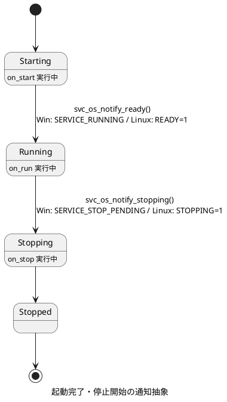
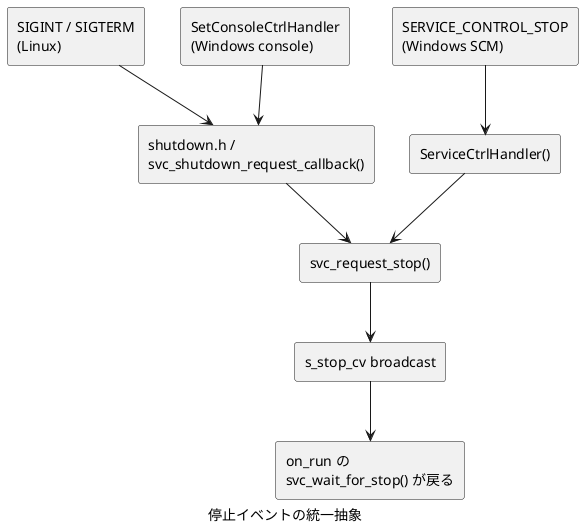
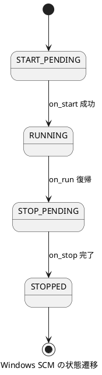

# service-sample

Windows サービス (SCM) と Linux systemd の両方に対応した  
クロスプラットフォーム サービス (デーモン) の C 言語サンプルです。

## 概要

このサンプルは、サービスのライフサイクル (起動・動作・停止) に対応します。  
コールバック関数を定義するだけで、Windows / Linux のいずれでも  
ネイティブ サービスとして動作する雛形を提供します。

### コマンド ライン

```bash
service-sample install    # OS にサービスを登録する
service-sample uninstall  # OS からサービスを解除する
service-sample run        # サービスとして起動する (SCM/systemd から呼ばれる)
service-sample console    # フォアグラウンドで実行する (デバッグ用)
```

### ライフサイクル コールバック

| コールバック | 呼ばれるタイミング | 実装すること | 必須 |
|---|---|---|---|
| on_start | サービス起動時に 1 回 | 初期化処理。0 を返すと on_run が呼ばれ、0 以外を返すと起動を中断します。 | 任意 |
| on_run | on_start 成功後に 1 回 | `svc_wait_for_stop()` が 1 を返すまで戻らないメイン ループ。 | 必須 |
| on_stop | on_run が戻った後に必ず 1 回 | 停止処理。 | 任意 |

フレームワークは `on_start` 成功直後に起動完了 (Windows: `SERVICE_RUNNING` / Linux: `READY=1`)、`on_run` 復帰直後に停止開始 (Windows: `SERVICE_STOP_PENDING` / Linux: `STOPPING=1`) を OS へ自動通知します。コールバック側でこれらを意識する必要はありません。



## ファイル構成

```text
prod/src/cmd/service-sample/
+-- service-sample.h          # 共通: ライフサイクル API・サービス定義・停止抽象
+-- service-sample.c          # 共通: 引数ディスパッチ・ライフサイクル駆動・停止抽象実体
+-- service-sample_linux.c    # Linux: run/install/uninstall の実装
+-- service-sample_windows.c  # Windows: SCM dispatch/ServiceMain/install/uninstall の実装
```

## 停止イベントの統一抽象

3 経路の停止シグナルを `svc_request_stop()` という単一関数に集約します。  
on_run の実装は `svc_wait_for_stop()` だけを見れば停止を検知できます。



内部では `cplat/sync` の condvar + lock を使って待機します。  
SCM の停止通知はシグナルではないため、condvar が 3 経路すべてに対応できる唯一の共通手段です。

## プラットフォームごとの動作

### Linux

| コマンド | 動作 |
|---|---|
| run | Type=notify として fork せずにフォアグラウンドで常駐 |
| install | /etc/systemd/system/{name}.service を生成し systemctl enable を実行 (root 必須) |
| uninstall | systemctl stop/disable を実行し unit ファイルを削除 (root 必須) |

### Windows

| コマンド | 動作 |
|---|---|
| run | StartServiceCtrlDispatcher で SCM ディスパッチャーに接続 |
| install | OpenSCManager + CreateService でサービスを登録 (管理者権限必須) |
| uninstall | OpenService + ControlService(STOP) + DeleteService で削除 (管理者権限必須) |

Windows SCM の状態遷移:



## ビルド

```bash
cd app/service-sample
make
```

ビルド成功後、以下のファイルが生成されます。

| ファイル | 説明 |
|---|---|
| `prod/cbin/service-sample` | 実行ファイル (Linux) |
| `prod/cbin/service-sample.exe` | 実行ファイル (Windows) |
| `prod/cbin/libcplat.so` / `prod/cbin/libcplat.dll` | cplat の実行時ライブラリ |
| `prod/cbin/libcjson.so` / `prod/cbin/libcjson.dll` | cplat が利用する cJSON の実行時ライブラリ |

Linux は `$ORIGIN` の RUNPATH、Windows は実行ファイルと同じディレクトリの DLL 探索により、これらのライブラリを解決します。

## 実行

### Linux: コンソール モード (デバッグ用)

```bash
./prod/cbin/service-sample console
# Ctrl+C で停止
```

### Linux: systemd サービスとして登録・実行

> [!NOTE]
> WSL2 では既定で systemd が無効です。
> `/etc/wsl.conf` に `[boot]` セクションで `systemd=true` を追加し、
> `wsl --shutdown` で再起動してから使用してください。

```bash
sudo ./prod/cbin/service-sample install
sudo systemctl start service-sample
journalctl -u service-sample -f
sudo systemctl stop service-sample
sudo ./prod/cbin/service-sample uninstall
```

### Windows: コンソール モード (デバッグ用)

```cmd
prod\cbin\service-sample.exe console
```

### Windows: サービスとして登録・実行 (管理者 PowerShell)

```powershell
.\prod\cbin\service-sample.exe install
sc.exe start service-sample
sc.exe query service-sample
sc.exe stop service-sample
.\prod\cbin\service-sample.exe uninstall
```

## 注意事項

- **WSL2 と systemd**: 既定では systemd が無効です。  
  検証は console モードを主とし、install/uninstall は systemd 有効な環境で行ってください。
- **Windows install/uninstall**: 管理者権限が必要です。  
  ERROR_ACCESS_DENIED が返る場合は管理者として実行してください。
- **Linux install**: root 権限が必要です。sudo で実行してください。
- **サービスの cwd**: SCM/systemd から起動されるサービスの作業ディレクトリはインストール時とは異なります  
  (Windows は `C:\Windows\System32`、systemd は `/`)。  
  本サンプルでは ExecStart/binPath に絶対パスを焼き込むことでこの問題を回避しています。  
  設定ファイルなどを読む場合は絶対パスを使用してください。
- **Windows サービスのログ出力**: SCM サービスにはコンソールがなく、printf の出力は失われます。  
  恒久的なログ出力には `cplat/trace` (Linux=syslog backend、Windows=ETW backend) を使用してください。
