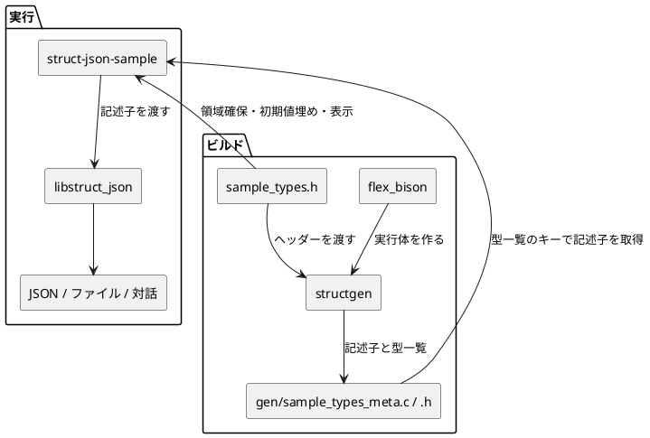

# 理解ノート

## 処理の流れ

## cmd/structgen

構造体のパースのための変換プログラムの実体。
これ自体は、ユーザー定義構造体とは関連しない。

まず、これを生成する必要がある。
そして、structgen のみが、flex/bison と関連を持っている。

ここで、何ができるかが決まる。
解析可能な型、取りだされるメタデータなど。

依存は持っていないが、暗黙的に app/struct-json-sample/prod/include/struct_json/struct_json_meta.h の構造を意識している。

## libsrc/struct_json

structgen の結果を扱うライブラリ。
ここも、ユーザー定義構造体とは関連しない。
structgen がルールに従って出力したメタデータ (記述子: sj_struct_desc) を用いた、各種操作を受け持つ。

## cmd/struct-json-sample

makepart.mk が sample_types.h を structgen で解析し、gen/ヘッダファイルのbody名_meta.c, .h で解析結果を格納。

変換された構造体一覧へのアクセスも提供される。(現状は enum ベース)

struct-json-sample.c は、sample_types.h を意識した状態で json 読み書きやパッチを行う。
JSON の読み書き・パッチは、sample_types.h に依存しない。

理屈の上では、すべてを記述子ベースの処理にすることで、struct-json-sample.c 自身は sample_types.h を意識せずに処理ができるが、現在の PoC 実装ではそこまで行っていない。
