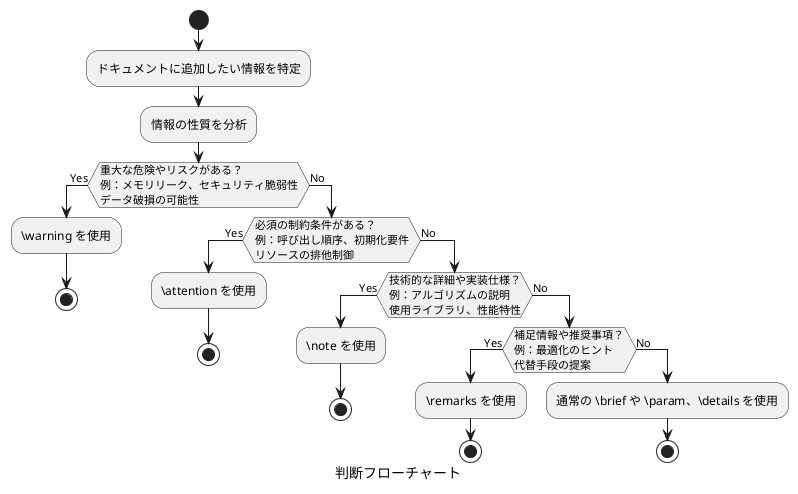

# コマンド (タグ) の解説 日本語版

[Doxygen - Special Commands](https://www.doxygen.nl/manual/commands.html) より、主に C 言語による開発で利用するコマンド (タグ) の説明を示します。

## `@brief { brief description }`

簡単な説明を表します。ファイルの場合、簡単な説明はページの先頭で使用されます。ファイル・メンバーの場合、簡単な説明はメンバーの宣言に配置され、詳細な説明の先頭に追加されます。

## `@param[<dir>] <parameter-name> { parameter description }`

名前が `<parameter-name>` の関数パラメータの説明を表します。

パラメータの存在がチェックされ、このパラメータ (またはその他のパラメータ) のドキュメンテーションが欠落しているか、関数の宣言または定義に存在しない場合は警告が表示されます。

このコマンドには、パラメーターの方向を指定するオプションの属性 `<dir>` があります。可能な値は `in`、`out`、および `in,out` です。`in,out` の場合、方向 `in` と `out` は任意の順序で指定でき、まとめて記述することも、コンマ (,) またはスペースで区切ることもできます。つまり、たとえば、値 `outin` や `in out` も有効です。

コンマ区切りリストを使用して、複数のパラメーターの説明を表すこともできます。例を以下に示します。

```c
/**
 *  @brief          Sets the position.
 *  @param[in]      x,y,z Coordinates of the position in 3D space.
 */
void setPosition(double x,double y,double z,double t);
```

## `@return { description of the return value }`

関数の戻り値の説明を表します。

## `@exception <exception-object> { exception description }`

**C++のみ**

名前が `<exception-object>` の例外オブジェクトの例外の説明を表します。

例外オブジェクトの存在はチェックされません。

## `@tparam <template-parameter-name> { description }`

**C++のみ**

名前が `<template-parameter-name>` の関数テンプレート パラメータの説明を表します。

## `@deprecated { description }`

非推奨であることを示す説明を表します。代替案、廃止予定などを説明するために使用します。

## `@see { references }`

クラス、関数、メソッド、変数、ファイル、または URL への 1 つ以上の相互参照を表します。

**C++のみ**

いくつかのオーバーロードされたメソッドまたはコンストラクターの 1 つは、メソッド名の後に引数の型の括弧で囲まれたリストを含めることによって指定します。

## `@author { list of authors }`

作成者を表します。

以下に 2 人の作成者を指定する例を示します。

```c
/**
 *  @brief          Pretty nice method.
 *  @details        This method is used to demonstrate a number of section commands.
 *  @author         John Doe
 *  @author         Jan Doe
 *  @version        4.1a
 *  @date           1990-2011
 *  @pre            First initialize the system.
 *  @bug            Not all memory is freed when deleting an object of this method.
 *  @warning        Improper use can crash your application.
 *  @copyright      GNU Public License.
 */
void SomeNiceMethod ();
```

Doxygen によって生成された対応する HTML ドキュメントについては、[こちら](https://www.doxygen.nl/manual/examples/author/html/class_some_nice_class.html) をクリックしてください。

## `@version { version number }`

バージョンを表します。

## `@since { text }`

いつのバージョン、あるいは、いつの時間から利用可能になる / なったかを表します。

## `@date { date description }`

日付を表します。作成日、最終更新日、開発期間などの日付情報を記録するために使用されます。どのような意味を持たせるかは、一般的プロジェクトごとに規定されます。

### `@date` の実際の使用例

+ プロジェクトの開発期間: `\date 2020-2023`
+ 特定機能の実装日: `\date 2024-01-15`
+ ライブラリのリリース時期: `\date March 2024@
+ API変更の日付: `\date Modified: 2024-03-10`
+ 文書の最終更新日: `\date Last updated: 2024-12-25`

## `@bug { bug description }`

バグまたはバグの可能性を表します。

## `@test { paragraph describing a test case }`

**テストコード内で使用**

テスト・ケースの説明を表します。以下に利用例を示します。

```c
/**
 *  @defgroup       MenuTests "Menu Testing Procedures"
 *  @brief          Manual testing procedures for menu functionality.
 */

/**
 *  @ingroup        MenuTests
 *  @test           Menu item selection test.
 *                  1. Open the application menu.
 *                  2. Click on "File" menu item.
 *                  3. Verify submenu appears.
 *                  4. Select "New Document" option.
 *                  5. Confirm new document is created.
 */
void testMenuSelection();
```

## `@todo { paragraph describing what is to be done }`

Todo 項目を表します。

```c
/**
 *  @todo           Todo リストを記載します。この行はリスト名となります (省略可能)。
 *                  - 子リスト1
 *                  - 子リスト2
 *                  - 子リスト3
 */
```

## `@pre { description of the precondition }`

前提条件 (関数が正しく動作するために満たすべき条件) を表します。

```c
/**
 *  @brief          Some description.
 *  @param[in]      grid1 First grid.
 *  @param[in]      grid2 Second grid.
 *  @pre            \p grid1 and \p grid2 must be of the same dimensions.
 */
```

```c
/**
 *  @brief          Trim leading and trailing whitespace from a string.
 *  @param[in,out]  str string to prune.
 *  @pre            \p str is non-empty.
 */
inline void trim(char *str) {
    // If the string is empty, do nothing
    // ...
}
```

## `@post { description of the postcondition }`

事後条件 (関数の実行完了後に満たされるべき条件や結果の状態) を表します。

```c
/**
 *  @brief          配列をソートします。
 * 
 *  @param[in,out]  arr ソート対象の配列を表します。
 *  @param[in]      size 配列のサイズを表します。
 * 
 *  @post           \p arr contains the same elements as before, but in sorted order.
 *  @post           arr[i] <= arr[i+1] for all valid i (0 <= i < size-1).
 *  @post           The original elements are preserved (no elements added or removed).
 */
void sortArray(int* arr, size_t size);
```

## `@invariant { description of invariant }`

不変条件を表します。不変条件とは、関数の実行前後で常に成り立つべき条件のことです。

## `@warning { warning message }`

重大なエラーや危険の回避のための警告を表します。

## `@attention { attention text }`

必須の制約条件・使用条件などの注意を表します。

## `@note { text }`

技術的な背景や実装の注釈を表します。

## `@remarks { remark text }`

使用上のヒントや最適化のアドバイスなどの補足情報を表します。

## `@par [(paragraph title)] { paragraph }`

ユーザー定義の見出しを使った説明を表します。Doxygen で用意されていない見出しを利用するために用います。見出しにどのような意味を持たせるかは、一般的にプロジェクトごとに規定されます。

`History` というユーザー定義の見出しを使った例を以下に示します。

```c
/**
 *  @par            History
 *                  - yyyy/mm/dd [修正ID](https://example.com/id/1234) 修正の概要を記載します。
 *                      - 子リスト1
 *                      - 子リスト2
 *                  - yyyy/mm/dd [修正ID](https://example.com/id/5678) 修正の概要を記載します。
 *                      - 子リスト1  
 *                        子リスト1の続き
 */
```

## `@details { detailed description }`

詳細な説明を表します。

`\brief` には概要のみを記載し、`\details` に詳細を記載します。

## `@copyright { copyright description }`

著作権の説明を表します。例を以下に示します。

```c
/**
 *  @copyright Copyright (C) CompanyName, Ltd. 2025. All rights reserved.
 */
```

```c
/**
 *  @copyright Copyright (C) CompanyName, Ltd. 2023-2025. All rights reserved.
 */
```

## `@startuml ~ @enduml`

PlantUML 形式の図を表します。

以下のように記載すると、[PlantUML プラグイン](https://marketplace.visualstudio.com/items?itemName=jebbs.plantuml) のプレビュー機能も活用できます。

```c
/**
 *  @brief          2 つの整数を除算します。
 *  @param[in]      a 被除数。
 *  @param[in]      b 除数。
 *  @return         除算結果。
 *  @details        PlantUML の図を挿入することができます。
    @startuml
        caption 図のテスト
        circle a
        circle b
        rectangle "a/b" as devide
        circle return
        a -> devide : 被除数
        b -> devide : 除数
        devide -> return
    @enduml
 *  @warning        \p b が 0 の場合、結果は未定義です。
 */
double divide(int a, int b);
```

## `@f[ ~ @f]`, `@f$ ~ @f$`

Latex の式を表します。複数行形式と行内形式の 2 つの書式があります。

```c
/**
 *  式のサンプル
    @f[
        (1 + 2 + 3) +
        (4 + 5 + 6) +
        (7 + 8 + 9) +
    @f]
 */
```

```c
/**
 *  式のサンプル
    @f$ \sum_{k=1}^n a_k @f$
 */
```

```c
#define THUMB_RGB565_SIZE  28800   /*!< RGB565 タイプのサムネイルサイズ @f$ (160 * 90 * 2) @f$ */
```

## `@defgroup <name> (group title)`

モジュールや機能のグループを定義します。

`@defgroup` を用いることで、一連の関数やクラス、変数などを一つのグループとしてまとめることができます。これにより、ドキュメントが読みやすくなり、大規模なコードベースでの情報管理に役立ちます。API ドキュメントなど、カテゴリー別の公開情報をまとめる場合に使用します。

例を以下に示します。

```c
/**
 *  @defgroup       MathFunctions "Mathematical Functions"
 *  @brief          Provides common mathematical functions.
 */

/**
 *  @ingroup        MathFunctions
 *  @brief          Calculates the factorial of a number.
 *  @param[in]      n An integer number.
 *  @return         The factorial of \p n.
 */
int factorial(int n);
```

## `@ingroup (<groupname> [<groupname>]*)`

既存のグループに機能を追加します。

`@ingroup` コマンドを用いることで、複数のファイルや異なる箇所に置かれた関連機能を一つのグループとしてドキュメント化できます。

```c
/**
 *  @ingroup        MathFunctions
 *  @brief          Calculates the greatest common divisor of two numbers.
 *  @param[in]      a First integer.
 *  @param[in]      b Second integer.
 *  @return         The greatest common divisor of \p a and \p b.
 */
int gcd(int a, int b);
```

## 注釈コマンド (タグ) 使い分けガイド

`\note`、`\warning`、`\remarks`、`\attention` の 4 つの注釈コマンド (タグ) を適切に使い分けるためのガイドラインを示します。

適切なコマンド (タグ) の使い分けにより、開発者にとって実用的で理解しやすいドキュメントを作成できます。各コマンド (タグ) の特徴を理解し、情報の重要度と緊急度に応じて適切に選択することで、コードの品質と保守性の向上につながります。

### 各タグの特徴と使い分け

#### 優先度・重要度マトリックス

| タグ         | 重要度     | 緊急度     | 主な用途                |
|--------------|------------|------------|-------------------------|
| `\warning`   | 🔴 高     | 🔴 高     | 重大なエラーや危険の回避 |
| `\attention` | 🔴 高     | 🟡 中     | 必須の制約条件・使用条件 |
| `\note`      | 🟡 中     | 🟡 中     | 技術的詳細・実装仕様     |
| `\remarks`   | 🟢 低～中 | 🟢 低     | 補足情報・推奨事項       |

### `@warning` - 危険回避のための警告

**使用場面**: 不適切な使用により重大な問題が発生する可能性がある場合

#### 適用例

```c
/**
 *  @brief          生のメモリポインタを操作します。
 *  @param[in,out]  ptr メモリポインタ。
 *  @param[in]      size 操作するサイズ。
 *  @warning        この関数を呼ぶ前に必ず ptr != nullptr を確認してください。
 *  @warning        \p size は実際のメモリサイズを超えてはいけません。
 */
void manipulateRawMemory(void* ptr, size_t size);

/**
 *  @brief          暗号化キーを生成します。
 *  @return         生成されたキー。
 *  @warning        生成されたキーは必ず安全な場所に保存してください。
 *  @warning        デバッグ時でもキーをログに出力しないでください。
 */
char* generateEncryptionKey();
```

#### 使用指針

- セキュリティリスクがある場合
- メモリリークやクラッシュの可能性がある場合
- データ破損の危険がある場合

### `@attention` - 必須の制約条件

**使用場面**: 正しい動作のために必ず守る必要がある条件や手順がある場合

#### 適用例

```c
/**
 *  @brief          データベース接続を初期化します。
 *  @param[in]      config 設定情報。
 *  @attention      この関数は main() 関数内で1回だけ呼び出してください。
 *  @attention      cleanup() を呼ぶ前に必ず disconnect() を実行してください。
 */
void initializeDatabase(const Config *config);

/**
 *  @brief          スレッドプールを作成します。
 *  @param[in]      threadCount スレッド数。
 *  @attention      \p threadCount は CPU コア数以下に設定してください。
 *  @attention      他のスレッドプールが動作中の場合は先に停止してください。
 */
void createThreadPool(int threadCount);
```

#### 使用指針

- 呼び出し順序が重要な場合
- 初期化・終了処理の制約がある場合
- リソースの排他制御が必要な場合

### `@note` - 技術的詳細・実装仕様

**使用場面**: 技術的な背景や実装の詳細を説明する場合

#### 適用例

```c
/**
 *  @brief          高速ソートアルゴリズムを提供します。
 *  @param[in,out]  data ソートするデータ。
 *  @note           このアルゴリズムはクイックソートを基に最適化されています。
 *  @note           平均時間計算量は O(n log n)、最悪時間計算量は O(n²) です。
 *  @note           安定ソートではありません。
 */
void fastSort(Data *data);

/**
 *  @brief          HTTP リクエストを送信します。
 *  @param[in]      url リクエスト URL。
 *  @return         レスポンス内容。
 *  @note           内部で libcurl ライブラリを使用しています。
 *  @note           タイムアウト値は 30 秒に設定されています。
 *  @note           SSL 証明書の検証を有効にしています。
 */
char *sendHttpRequest(const char *url);
```

#### 使用指針

- アルゴリズムの説明
- 使用しているライブラリの情報
- 性能特性の説明
- 実装の技術的な詳細

### `@remarks` - 補足情報・推奨事項

**使用場面**: 使用上のヒントや最適化のアドバイスを提供する場合

#### 適用例

```c
/**
 *  @brief          大量のデータを処理します。
 *  @param[in]      dataset 処理するデータセット。
 *  @remarks        10 万件以上のデータの場合は並列処理版の使用を推奨します。
 *  @remarks        メモリ使用量はデータサイズの約 1.5 倍になります。
 *  @remarks        処理中にプログレスバーを表示することを推奨します。
 */
void processLargeDataset(const Dataset *dataset);

/**
 *  @brief          設定ファイルを読み込みます。
 *  @param[in]      filePath ファイルパス。
 *  @return         設定内容。
 *  @remarks        起動時のパフォーマンスを向上させるため、設定をキャッシュすることを推奨します。
 */
Config *loadConfiguration(const char *filePath);
```

#### 使用指針

- パフォーマンス最適化のヒント
- 代替手段の提案
- 使用経験に基づくアドバイス
- 設計上の考慮事項

### 実践的な使い分け例

#### 複数タグを組み合わせた例

```c
/**
 *  @brief          金融取引を実行します。
 *  @param[in]      transaction 取引情報。
 *  @param[in]      account 口座情報。
 *  @return         取引結果。
 *
 *  @attention      取引実行前に必ず口座残高を確認してください。
 *  @warning        取引が失敗した場合でも重複実行は禁止です。
 *  @note           取引履歴は自動的にデータベースに保存されます。
 *  @remarks        高頻度取引の場合はバッチ処理の使用を検討してください。
 */
TransactionResult *executeTransaction(const Transaction *transaction, 
                                      const Account *account);
```

### 判断フローチャート



## その他

### コマンド (タグ) の接頭子

Doxygen では、コマンドの先頭に `@` もしくは `\` のどちらを使用しても機能しますが、一般的なスタイルとして多くのプロジェクトやガイドラインでは `@` が推奨されている場合が多いです。

統一性を保つためには、プロジェクト内でどちらかに統一すると良いでしょう。

例を以下に示します。

```c
/**
 *  @brief          This function does something important.
 *
 *  @param[in]      param1 Description of param1.
 *  @return         Description of return value.
 */
int exampleFunction(int param1) {
    // Function implementation
    return 0;
}
```

または

```c
/**
 *  \brief          This function does something important.
 *
 *  \param[in]      param1 Description of param1.
 *  \return         Description of return value.
 */
int exampleFunction(int param1) {
    // Function implementation
    return 0;
}
```

どちらかに揃えてください。
