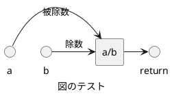

<!-- IMPORTANT: This is an AUTOMATICALLY GENERATED file by doxygen and doxybook. Manual edits are NOT allowed. -->

# src/calculator.c

ファイルの概要を表します。

**Deprecated**:

非推奨であることを記載します。

**Author**: 初版作成者を表します。

**Version**: 現在のバージョンを表します。

**Since**: コードや API がいつから利用可能になったかを記載します。

**Date**: yyyy/mm/dd (初版作成年月日を表します。)

**Note**: 一般的な注釈を記載します。

**Todo**: Todo リストを記載します。この行はリスト名となります (省略可能)。

* 子リスト1
* 子リスト2
* 子リスト3

**Warning**: 警告を記載します。

**Remarks**: 詳細な説明や補足情報を記載します。

**Attention**: 注意を記載します。

**History**:

* yyyy/mm/dd [修正ID](https://example.com/id/1234) 修正の概要
    * 子リスト1
    * 子リスト2
* yyyy/mm/dd [修正ID](https://example.com/id/5678) 修正の概要
    * 子リスト1  
子リスト1の続き

**Details**:

タグのないコメントは、details として扱われます。

PlantUML の図を挿入することができます。  
VSCode の PlantUML プラグインを使用するために、行頭の * は記載しないことを推奨します。



Copyright (c) YYYY Sample Inc. All Rights reserved.

## 関数

### subtract

```cpp
int subtract (
    int a,
    int b
)
```

二つの整数を減算する関数

**Parameters**:

* [in] a 被減数
* [in] b 減数

**Return**: 減算結果

**Todo**: 単項目の Todo

### multiply

```cpp
int multiply (
    int a,
    int b
)
```

二つの整数を乗算する関数

**Parameters**:

* [in] a 第一因数
* [in] b 第二因数

**Return**: 乗算結果

### divide

```cpp
double divide (
    int a,
    int b
)
```

二つの整数を除算する関数

**Parameters**:

* [in] a 被除数
* [in] b 除数

**Return**: 除算結果

**Note**: 特別な注意事項を示します。

**Warning**: b が 0 の場合、結果は未定義です

**Details**:

PlantUML の図を挿入することができます。  
VSCode の PlantUML プラグインを使用するために、行頭の * は記載しないことを推奨します。


### add

```cpp
int add (
    int a,
    int b
)
```

二つの整数を加算する関数

**Parameters**:

* [in] a 第一オペランド
* [in] b 第二オペランド

**Deprecated**:

非推奨の機能であることを示す。

**Return**: 加算結果

**Since**: いつから利用可能かを示す。

**Todo**:

* コメントを記載する
* ログ機能を実装する
* 将来的に浮動小数点対応を追加する

**Precondition**: 関数の前提条件。

**Postcondition**: 関数の後の保証。

**Remarks**: この関数はスレッド セーフです。

**Details**:

詳細な説明や、特定の使用例などの追加情報を  
複数行にわたって記述することができます。

改行は、<br>  
と 2 個の空白どちらでも動作します。

* 箇条書き1
    * 箇条書き1-1
    * 箇条書き1-2
* 箇条書き2

このように、箇条書きも記載できます。
