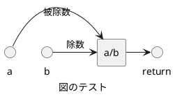

# src/calculator.c

計算機の実装ファイル 


## 関数
### subtract
```cpp
int subtract (
    int a,
    int b
)
```

二つの整数を減算する関数 

**Parameters**: 

  * [in] a 被減数 
  * [in] b 減数 


**Return**: 減算結果 


### multiply
```cpp
int multiply (
    int a,
    int b
)
```

二つの整数を乗算する関数 

**Parameters**: 

  * [in] a 第一因数 
  * [in] b 第二因数 


**Return**: 乗算結果 


### divide
```cpp
double divide (
    int a,
    int b
)
```

二つの整数を除算する関数 

**Parameters**: 

  * [in] a 被除数 
  * [in] b 除数 


**Return**: 除算結果 

**Warning**: b が 0 の場合、結果は未定義です 

**Figure**: 


 


### add
```cpp
int add (
    int a,
    int b
)
```

二つの整数を加算する関数 

**Parameters**: 

  * [in] a 第一オペランド 
  * [in] b 第二オペランド 


**Return**: 加算結果 


