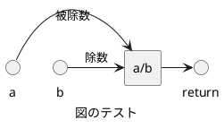

<!-- IMPORTANT: This is an AUTOMATICALLY GENERATED file by doxygen and doxybook. Manual edits are NOT allowed. -->

# src/calculator.h

簡単な計算機のヘッダーファイル

**Author**: あなたの名前

**Version**:

* version 1 の説明
* version 2 の説明

**Since**: いつから利用可能かを示す。

**Date**: 2025-06-27

**Copyright**: コピーライト

**Details**:

詳細な説明
 詳細な説明 (2 行目)

## 関数

### subtract

```cpp
int subtract (
    int a,
    int b
)
```

二つの整数を減算する関数

**Parameters**:

* [in] a 被減数
* [in] b 減数

**Return**: 減算結果

**Todo**: 単項目の Todo

### multiply

```cpp
int multiply (
    int a,
    int b
)
```

二つの整数を乗算する関数

**Parameters**:

* [in] a 第一因数
* [in] b 第二因数

**Return**: 乗算結果

### divide

```cpp
double divide (
    int a,
    int b
)
```

二つの整数を除算する関数

**Parameters**:

* [in] a 被除数
* [in] b 除数

**Return**: 除算結果

**Note**: 特別な注意事項を示します。

**Warning**: b が 0 の場合、結果は未定義です

**Details**:

PlantUML の図を挿入することができます。
 VSCode の PlantUML プラグインを使用するために、行頭の * は記載しないことを推奨します。



### add

```cpp
int add (
    int a,
    int b
)
```

二つの整数を加算する関数

**Parameters**:

* [in] a 第一オペランド
* [in] b 第二オペランド

**Deprecated**:

非推奨の機能であることを示す。

**Return**: 加算結果

**Since**: いつから利用可能かを示す。

**Todo**:

* コメントを記載する
* ログ機能を実装する
* 将来的に浮動小数点対応を追加する

**Precondition**: 関数の前提条件。

**Postcondition**: 関数の後の保証。

**Remarks**: この関数はスレッド セーフです。

**Details**:

詳細な説明や、特定の使用例などの追加情報を
 複数行にわたって記述することができます。

* 箇条書き1
* 箇条書き2

このように、箇条書きも記載できます。

## 定数、マクロ

### TEISU

```cpp
#define TEISU (1)
```

定数

## 構造体

### UserInfo

```cpp
struct UserInfo {
    const char * name;
    int id;
}
```

ユーザー情報を保持する構造体

#### name

```cpp
const char * name;
```

ユーザー名

#### id

```cpp
int id;
```

ユーザーID
