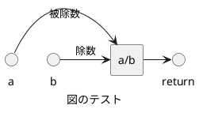

<!-- IMPORTANT: This is an AUTOMATICALLY GENERATED file by doxygen and doxybook. Manual edits are NOT allowed. -->

# src/calculator.h

## ファイル

### src/calculator.h

計算機の定義を提供します。

#### Author

初版作成者

#### Version

1.0

#### Date

2025/07/08

#### History

* 2025/07/08 新規作成

#### Copyright

Copyright (C) CompanyName, Ltd. 2025. All rights reserved.

## 関数

### subtract

```cpp
int subtract (
    int a,
    int b
)
```

`a` から `b` を減算します。

#### Parameters

* [in] a 被減数
* [in] b 減数

#### Return

減算結果。

#### Remarks

この関数はスレッド セーフです。

### multiply

```cpp
int multiply (
    int a,
    int b
)
```

`a` と `b` を乗算します。

#### Parameters

* [in] a 因数a
* [in] b 因数b

#### Return

乗算結果。

#### Remarks

この関数はスレッド セーフです。

### divide

```cpp
double divide (
    int a,
    int b
)
```

`a` を `b` で除算します。

#### Parameters

* [in] a 被除数
* [in] b 除数

#### Return

除算結果。

#### Warning

`b` が 0 の場合、結果は未定義です。

#### Remarks

この関数はスレッド セーフです。

#### Details



### add

```cpp
int add (
    int a,
    int b
)
```

`a` と `b` を加算します。

#### Parameters

* [in] a 加算数a
* [in] b 加算数b

#### Return

加算結果。

#### Remarks

この関数はスレッド セーフです。

## 定数、マクロ

### ZERO_DEVIDE

```cpp
#define ZERO_DEVIDE (0.0)
```

ゼロ除算の戻り値を定義します。

## 構造体

### UserInfo

```cpp
struct UserInfo {
    const char * name;
    int id;
}
```

ユーザー情報を保持する構造体を定義します。

#### name

```cpp
const char * name;
```

ユーザー名

#### id

```cpp
int id;
```

ユーザーID
